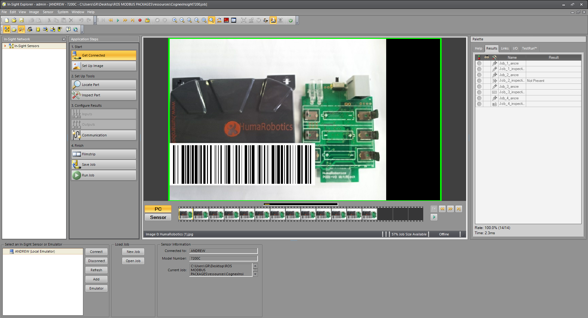
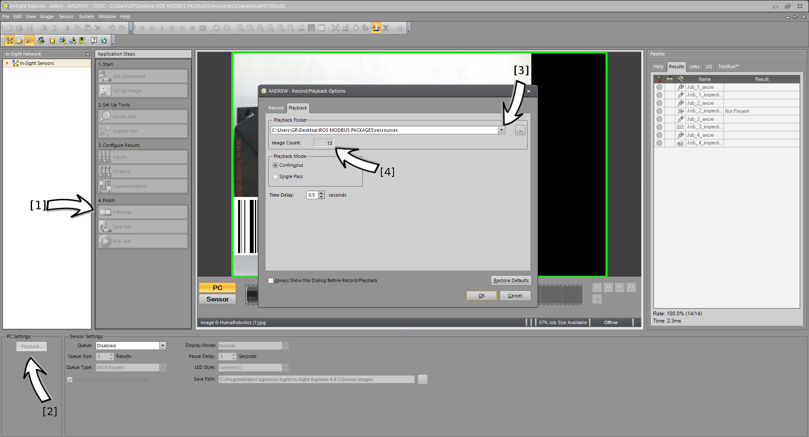
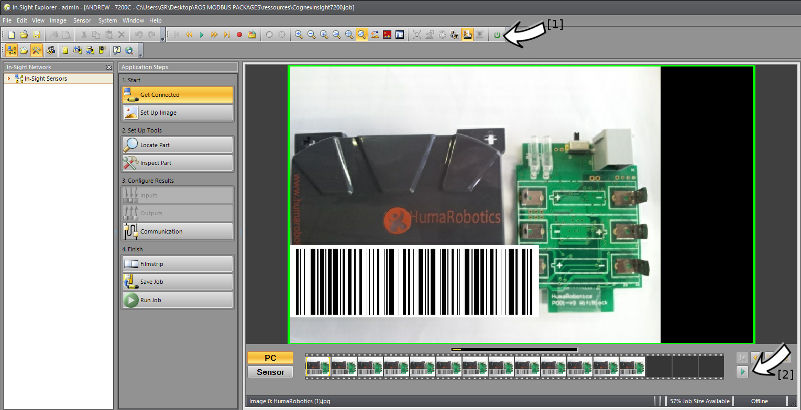
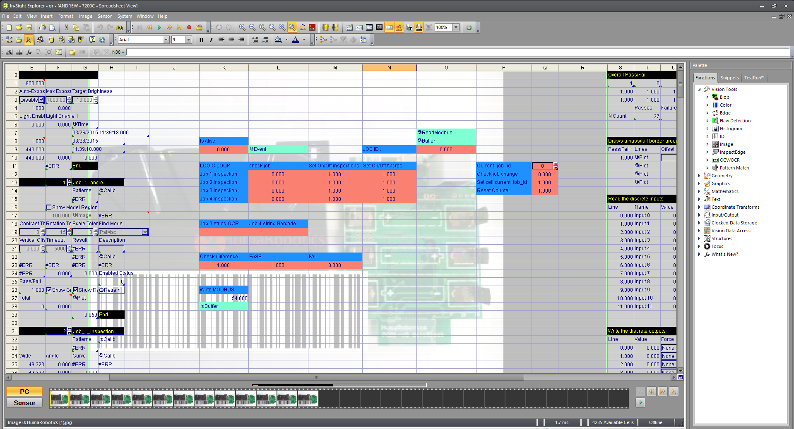

modbus cognex insight
=====================

This package is a bridge between a python modbus client and a Cognex In-Sight camera as modbus server.
A job test is present in this package to test it without a camera.

This package includes:

 * A job test to load in In-Sight Explorer 
 * A ROS node to interface a <strong>Cognex In-Sight Camera</strong> with a ROS environment 


##### Inspected image : 

<center></center>

## Configuration needed

* This package was tested on <strong> Ubuntu 14.04 with ROS Indigo </strong>.

* To be completely tested, this package needs a second workstation that has a <strong> Microsoft Windows (7/8/8.1) environment with Cognex vision software </strong>.

* This package was tested with a <strong> Cognex In-Sight 7200 Camera </strong> 

## Running the ROS node / modbus client

For starting a modbus client that connects to a modbus server on the cognex insight camera, use the command below. 
Before running the node, replace the ip address with the address from your camera or simulator. Try first, if you are able to ping it and verify that the modbus server is activated.
```
	$ rosrun modbus_wrapper modbus_client_insight7200.py _ip:="192.168.199" _sim:=True
```

In the default configuration the cognex simulator is used. As the mechanics are a little bit different for the real camera, change the argument to "_sim=False", in order to use the real camera.

## Install In-Sight Explorer 4.9.3

### Download

You will find the software here  [In-Sight Explorer 4.9.3 Software](http://www.cognex.com/support/downloads/File.aspx?d=2913)

### Get a key to use the emulator

To use In-Sight Explorer without a camera a useful emulator is present in the software. 
However a key is needed to unlock the emulator software.

The following instructions will help with this process : 
[In-Sight® Key Generator](http://www.cognex.com/support/iskeygenerator.aspx)

## Load the job test file in In-Sight Explorer

* The job test to load is in <strong> /resources/Insight </strong>, its name is <strong> CognexInsight7200.job</strong>.

Click on <strong> File and Open Project </strong> and select this job file.



### Load the Filmstrip and go Online

To test this package without a camera, a <strong>filmstrip</strong> has to be added.

In the main interface click on <strong>Filmstrip [1]</strong> and then on <strong>Playback [2]</strong>  (bottom left of the interface).

Set the <strong>Playback Folder [3]</strong> to modbus_wrapper\modbus_cognex_insight\resources\Insight. The image Count should update to <strong>13 [4]</strong>.



After setting up the filmstrip, click on <strong> the Online icon [1]</strong>.

On the Image view interface click on the <strong> Play icon [2]</strong> so that the filmstrip is streamed.



### Spreadsheet view

To create this test job, 4 inspections were done on the initial image.

A <strong>job change system </strong> using the modbus package was put together thanks to this package.

The modbus package (here used as a client) send the job id (one of the 4 inspections) to the modbus server running on the emulator (or the real camera). 

The job id is read in the <strong>ReadModbus</strong> function of the In-Sight spreadsheet.

Each time a job is selected, all the <strong>other jobs are deactivated</strong>.

The result is then sent to the ROS modbus client in an array:
```
[CameraIsAlive, Job_ID, Pass/Fail, String containing some text , String containing the barcode]
```




## Contributors

This package was developed by Sven Bock and Wagdi Ben Yaala at [Generation Robots](http://www.generationrobots.com/en/)/[Humarobotics](http://www.humarobotics.com) in Bordeaux, France.
 
