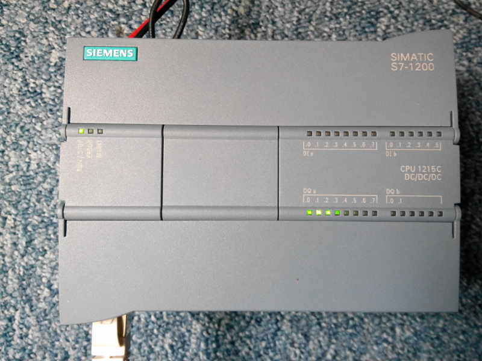

modbus plc siemens
====================

This pacakge is a bridge between a python modbus client and a Siemens PLC as modbus server.


This package includes:

 * A project test to load in TIA Portal 
 * A ROS node to interface a <strong>Siemens PLC </strong> with a ROS environment 


 

## Configuration needed

* This package was tested on <strong> Ubuntu 14.04 with ROS Indigo </strong>

* To be completely tested this package needs a second workstation that has a <strong> Microsoft Windows (7/8/8.1) environment with Siemens TIA Portal</strong>

* This package was tested with a <strong> S7-1200 Siemens PLC </strong> on <strong>TIA Portal v13</strong>


## Quickstart

Download the TIA Portal project (in modbus_wrapper/modbus_plc_siemens/resources/[TIA_PORTAL] S7_1200_Modbus_wrapper) to your siemens PLC to enable the modbus server on the PLC.

Make sure you are able to ping the PLC from the workstation, where you execute your ROS node. 

Start a modbus client that connects to a modbus server on PLC, running the programm of the resources directory. 
Replace the ip address with the address from your PLC. Try first if you are able to ping it.
```
	$ rosrun modbus_wrapper modbus_client_s7_1200.py _ip:="192.168.199" _port:=502
```

You should see the first 6 leds flashing like here:
[](https://youtu.be/1YarNPR-FwI)

## Contributors

This package was developed by Sven Bock and Wagdi Ben Yaala at [Generation Robots](http://www.generationrobots.com/en/)/[Humarobotics](http://www.humarobotics.com) in Bordeaux, France.